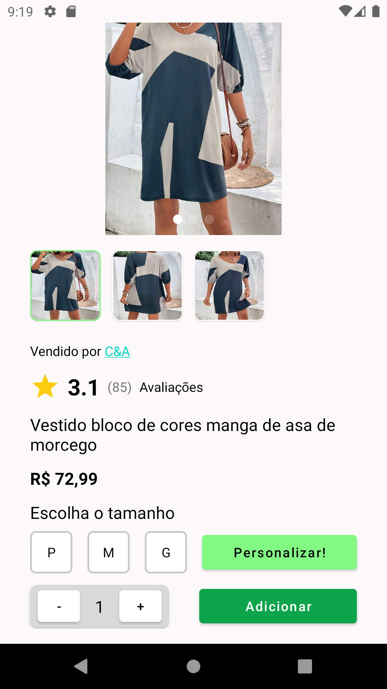
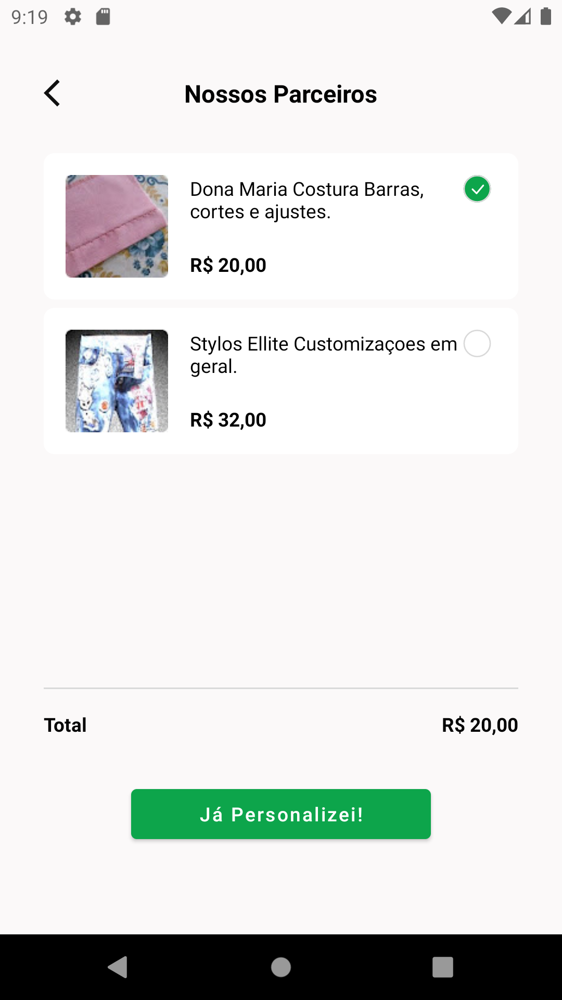
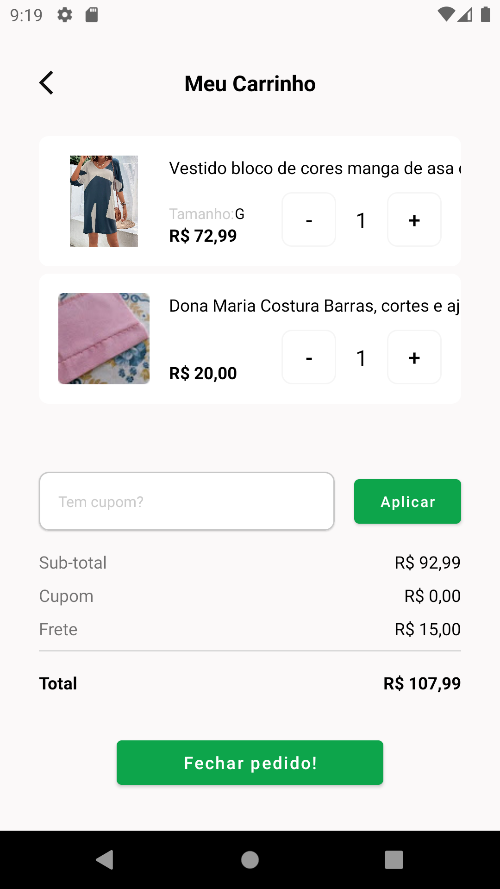

# Tem Aqui
App desenvolvido para o TCC Startup One na FIAP. Densolvido para android baseado no [protótipo no Figma](https://www.figma.com/proto/OOkqI6NDgyqFmebSC9sTpi/FIAP?node-id=1-135&scaling=min-zoom&page-id=0%3A1&starting-point-node-id=1%3A135). 

O aplicativo foi desenvolvido usando tecnologias nativas da plataforma, escrito na linguagem de programação Kotlin, usando a arquitetura MVVM(Model-View-ViewModel para garantir uma separação clara entre a lógica de negócio e a interface do usuário.

Também utilizamos coroutines, uma biblioteca do Kotlin, para lidar com tarefas assíncronas de forma simplificada e mais legível e fácil de manter.

O aplicativo possui pelo menos 80% de cobertura de testes unitários para todas as classes que cuidam das regras de negócio(repositories e viewModel).
Também desenvolvemos uma pipeline usando o github actions para a CI/CD, verificando se todos os testes estão passando, e fazendo a publicação do aplicativo de forma automatizada.

## Screenshots

